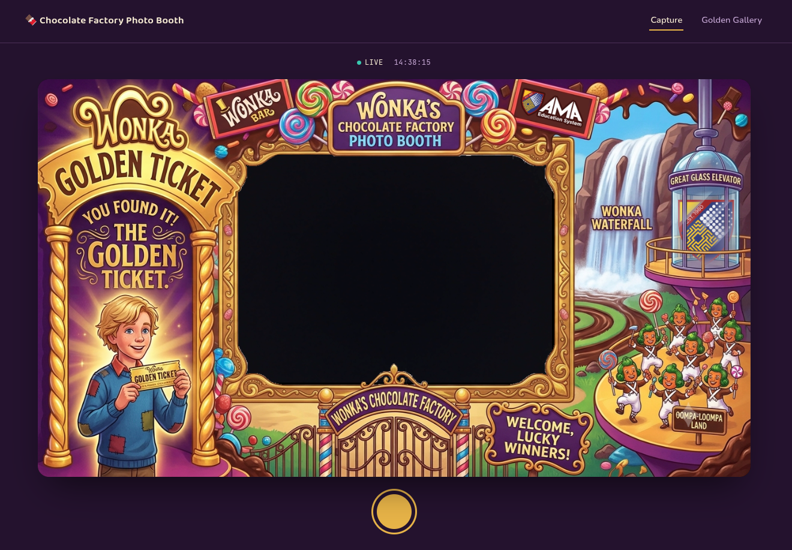
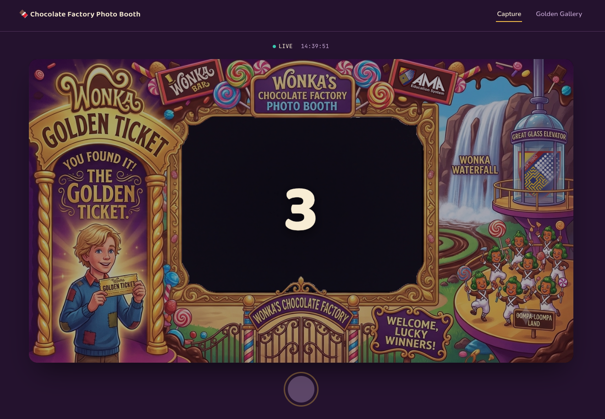
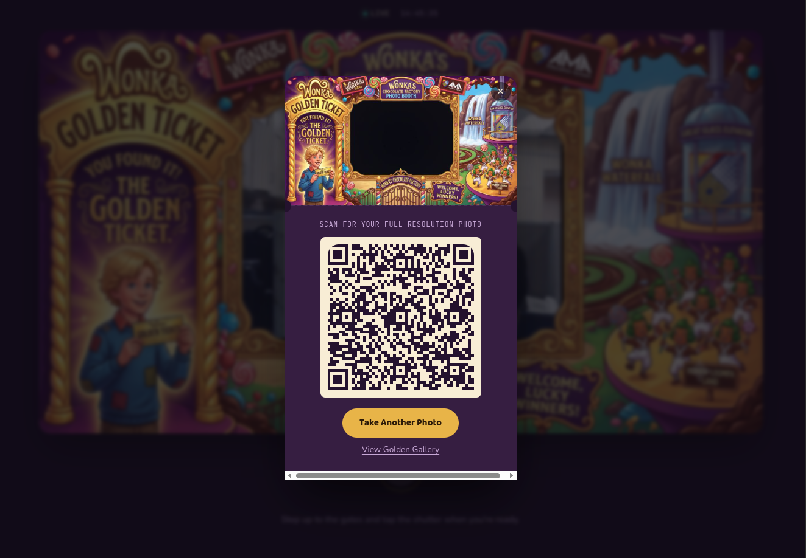
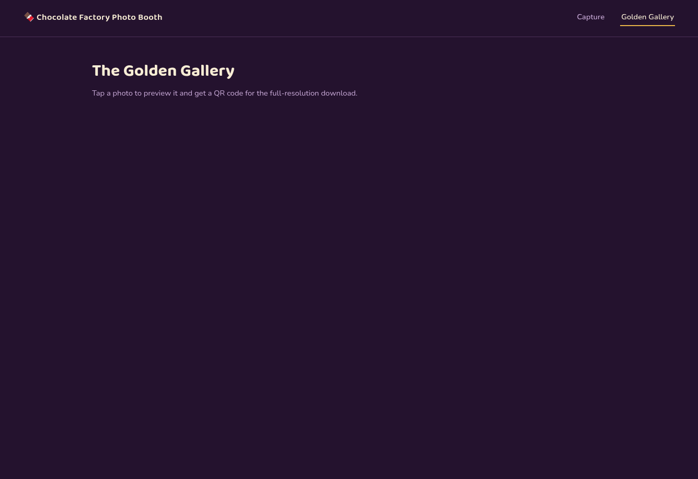

# Photobooth Web Application

A web-based photobooth application that captures photos with decorative borders, uploads them to AWS S3, and provides a gallery view with QR code sharing functionality.

## Screenshots

### Capture Page

The main capture interface with live camera feed and border overlay.



### Countdown Timer

Countdown timer displayed when taking a photo, giving users time to pose.



### Successful Capture

Confirmation shown after successfully capturing and uploading a photo.



### Gallery Page

Browse all captured photos with QR code generation for easy mobile sharing.



## Features

- 📸 **Live Camera Capture** - Real-time camera feed with instant photo capture
- ⏱️ **Countdown Timer** - Gives users time to pose before capture
- 🖼️ **Custom Border Overlay** - Apply decorative borders to photos client-side before upload
- 🎨 **Dual Resolution Support** - Saves both low-resolution (thumbnails) and high-resolution versions
- ☁️ **AWS S3 Storage** - Automatic upload of photos to Amazon S3
- 🖼️ **Photo Gallery** - View all captured photos in a responsive gallery
- 📱 **QR Code Sharing** - Generate QR codes for easy photo sharing and download
- 💾 **SQLite Database** - Lightweight local database for photo metadata
- ⚡ **FastAPI Backend** - Modern, fast Python web framework
- ✅ **Visual Feedback** - Success notifications after capture

## Tech Stack

**Backend:**

- FastAPI - Modern Python web framework
- Uvicorn - ASGI server
- SQLite - Embedded database
- Boto3 - AWS SDK for Python
- Python-dotenv - Environment variable management

**Frontend:**

- Vanilla JavaScript
- HTML5 Canvas for image compositing
- QR Code generation library
- Responsive CSS

**Storage:**

- AWS S3 - Cloud object storage

## Project Structure

```
photobooth_web/
├── main.py                     # FastAPI application entry point
├── database.py                 # SQLite connection and schema management
├── s3_client.py               # AWS S3 upload utilities
├── requirements.txt           # Python dependencies
├── .env.example              # Environment variable template
├── photobooth.db             # SQLite database (created on first run)
├── modules/
│   ├── camera_capture/       # Photo capture module
│   │   ├── router.py        # API endpoints for photo upload
│   │   ├── service.py       # Business logic for photo processing
│   │   ├── repository.py    # Database operations
│   │   └── schema.py        # Pydantic models
│   └── gallery/              # Gallery module
│       ├── router.py        # API endpoints for gallery
│       ├── service.py       # Business logic for photo listing
│       ├── repository.py    # Database queries
│       └── schema.py        # Pydantic models
├── static/
│   ├── templates/           # HTML templates
│   │   ├── capture.html    # Photo capture page
│   │   └── gallery.html    # Gallery view page
│   ├── js/                 # JavaScript files
│   │   ├── capture.js      # Capture page logic
│   │   ├── gallery.js      # Gallery page logic
│   │   └── qrcode.js       # QR code generation
│   ├── css/                # Stylesheets
│   │   └── style.css       # Application styles
│   └── assets/             # Images and static assets
│       ├── border.png      # Photo border overlay
│       ├── capture_page.png
│       ├── timer.png
│       ├── successful_capture.png
│       └── gallery_page.png
├── delete_scripts/         # Utility scripts
│   ├── delete_db.py       # Database cleanup
│   └── delete_s3_prefix.py # S3 cleanup
└── tools/
    └── detect_window.py    # Window detection utility
```

## Prerequisites

- Python 3.14+ (or 3.10+)
- AWS Account with S3 access
- Webcam/camera device

## Installation

### 1. Clone the repository

```bash
git clone <repository-url>
cd photobooth_web
```

### 2. Create and activate virtual environment

```bash
python -m venv venv
source venv/bin/activate  # On Linux/Mac
# or
venv\Scripts\activate     # On Windows
```

### 3. Install dependencies

```bash
pip install -r requirements.txt
```

### 4. Configure environment variables

Create a `.env` file based on `.env.example`:

```bash
cp .env.example .env
```

Edit `.env` with your AWS credentials:

```env
AWS_ACCESS_KEY_ID=your_access_key_id
AWS_SECRET_ACCESS_KEY=your_secret_access_key
AWS_REGION=us-west-2
S3_BUCKET=your-s3-bucket-name
AWS_PREFIX=your_prefix_folder
```

**Important:** Make sure your S3 bucket has appropriate permissions for public read access if you want photos to be viewable via direct URLs.

### 5. Run the application

```bash
python main.py
```

Or using uvicorn directly:

```bash
uvicorn main:app --host 0.0.0.0 --port 8000 --reload
```

The application will be available at:

- Main capture page: http://localhost:8000
- Gallery page: http://localhost:8000/gallery
- API documentation: http://localhost:8000/docs

## Usage

### Capturing Photos

1. Navigate to http://localhost:8000
2. Allow camera permissions when prompted
3. Position yourself in the camera frame
4. Click the capture button
5. A countdown timer will appear (5-4-3-2-1)
6. The photo will be captured and automatically uploaded to S3 with the border overlay applied
7. A success notification will confirm the upload

### Viewing Gallery

1. Navigate to http://localhost:8000/gallery
2. Browse all captured photos as thumbnails
3. Click on any photo to view full screen
4. Scan the QR code to download the high-resolution version on your mobile device

## API Endpoints

### Camera Capture

**POST** `/api/photos`

- Upload captured photos (both low-res and high-res)
- **Request:** Multipart form data with two image files
  - `low_res`: Low resolution JPEG
  - `high_res`: High resolution JPEG
- **Response:** Photo metadata including S3 URLs and UUID

```json
{
  "uuid": "123e4567-e89b-12d3-a456-426614174000",
  "s3_url_low_res": "https://bucket.s3.region.amazonaws.com/prefix/photos/uuid/low_res.jpg",
  "s3_url_high_res": "https://bucket.s3.region.amazonaws.com/prefix/photos/uuid/high_res.jpg",
  "created_at": "2026-07-03T14:48:00"
}
```

### Gallery

**GET** `/api/gallery`

- Retrieve all photos
- **Response:** List of photos with low-res and high-res URLs

```json
{
  "photos": [
    {
      "uuid": "123e4567-e89b-12d3-a456-426614174000",
      "s3_url_low_res": "https://...",
      "s3_url_high_res": "https://...",
      "created_at": "2026-07-03T14:48:00"
    }
  ]
}
```

## Database Schema

The application uses SQLite with a single `photos` table:

```sql
CREATE TABLE photos (
    id INTEGER PRIMARY KEY AUTOINCREMENT,
    uuid TEXT NOT NULL UNIQUE,
    s3_url_low_res TEXT NOT NULL,
    s3_url_high_res TEXT NOT NULL,
    created_at TEXT NOT NULL DEFAULT (datetime('now'))
)
```

## AWS S3 Configuration

### Bucket Policy Example

To allow public read access to your photos:

```json
{
  "Version": "2012-10-17",
  "Statement": [
    {
      "Sid": "PublicReadGetObject",
      "Effect": "Allow",
      "Principal": "*",
      "Action": "s3:GetObject",
      "Resource": "arn:aws:s3:::your-bucket-name/*"
    }
  ]
}
```

### IAM User Permissions

Your IAM user needs at least these permissions:

```json
{
  "Version": "2012-10-17",
  "Statement": [
    {
      "Effect": "Allow",
      "Action": ["s3:PutObject", "s3:GetObject"],
      "Resource": "arn:aws:s3:::your-bucket-name/*"
    }
  ]
}
```

## Development

### Running in Development Mode

The application automatically runs in reload mode when started via `main.py`:

```bash
python main.py
```

### Project Architecture

The project follows a modular architecture with clear separation of concerns:

- **Router Layer** - Handles HTTP requests and responses (FastAPI routes)
- **Service Layer** - Contains business logic
- **Repository Layer** - Handles database operations
- **Schema Layer** - Defines Pydantic models for validation

### Adding New Modules

To add a new module:

1. Create a new directory under `modules/`
2. Add `router.py`, `service.py`, `repository.py`, and `schema.py`
3. Register the router in `main.py`:

```python
from modules.your_module.router import router as your_module_router
app.include_router(your_module_router)
```

## Troubleshooting

### Camera Not Working

- Ensure your browser has camera permissions enabled
- Check that no other application is using the camera
- Try using HTTPS (required for camera access on non-localhost domains)
- Some browsers require HTTPS even for local development (except localhost)

### S3 Upload Failures

- Verify AWS credentials in `.env` are correct
- Check S3 bucket name and region match your configuration
- Ensure IAM user has proper S3 permissions
- Verify network connectivity to AWS
- Check that the S3 bucket exists and is accessible

### Database Locked Errors

- The application uses connection pooling with a 10-second timeout
- If you encounter locks, ensure no other process is accessing `photobooth.db`
- Close any database browser tools that might have the file open

### Import Errors

If you see import errors like `cannot import name 'build_key'`, ensure:

- All dependencies are installed: `pip install -r requirements.txt`
- You're using the correct Python version (3.10+)
- The virtual environment is activated

## Utility Scripts

### Delete Database

```bash
python delete_scripts/delete_db.py
```

Removes the local SQLite database file. Useful for resetting the application state.

### Delete S3 Prefix

```bash
python delete_scripts/delete_s3_prefix.py
```

Removes all objects under the configured S3 prefix. Useful for cleanup during development or testing.

**Warning:** This will permanently delete all photos from S3. Use with caution!

## Security Considerations

- ⚠️ **Never commit `.env` file** - It contains sensitive AWS credentials (already in .gitignore)
- 🔒 Use IAM roles when deploying to EC2/ECS instead of hardcoded credentials
- 🛡️ Consider implementing authentication for production use
- 🔐 Use presigned URLs for more secure S3 access patterns
- 🚨 Implement rate limiting on upload endpoints to prevent abuse
- 📝 Add CORS configuration appropriate for your deployment domain
- 🔒 Consider implementing user consent/privacy notices before capturing photos

## Performance Tips

- The application creates low-res thumbnails client-side to optimize gallery loading
- High-res images are only accessed when generating QR codes
- SQLite is sufficient for small to medium deployments (< 10,000 photos)
- Consider migrating to PostgreSQL for larger scale deployments
- Use CloudFront CDN in front of S3 for better performance

## Deployment

### Basic Production Deployment

1. Set `reload=False` in `main.py` for production
2. Use a process manager like `systemd` or `supervisor`
3. Set up a reverse proxy (nginx/Apache) for HTTPS
4. Configure proper CORS settings
5. Use environment variables for all configuration
6. Set up monitoring and logging

### Example systemd Service

```ini
[Unit]
Description=Photobooth Web Application
After=network.target

[Service]
Type=simple
User=www-data
WorkingDirectory=/path/to/photobooth_web
Environment="PATH=/path/to/photobooth_web/venv/bin"
ExecStart=/path/to/photobooth_web/venv/bin/python main.py
Restart=always

[Install]
WantedBy=multi-user.target
```

## License

[Add your license information here]

## Contributing

[Add contribution guidelines here]

## Author

[Add author information here]

## Acknowledgments

- QR Code library for easy photo sharing
- FastAPI framework for the robust backend
- HTML5 Canvas API for client-side image processing

---

**Note:** This project is designed for event photobooth use cases. Ensure you have appropriate permissions and consent before capturing and storing photos of individuals. Consider adding privacy notices and data retention policies for GDPR compliance.
